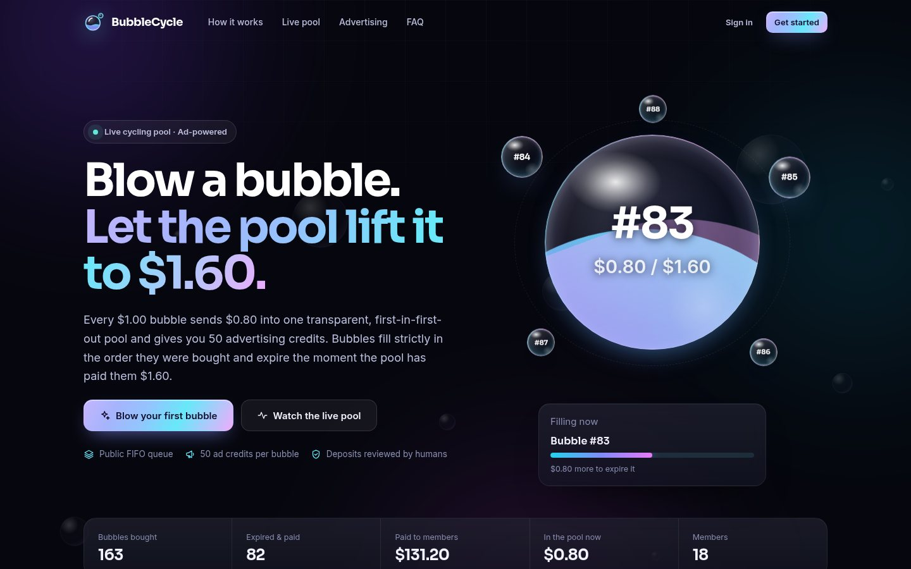
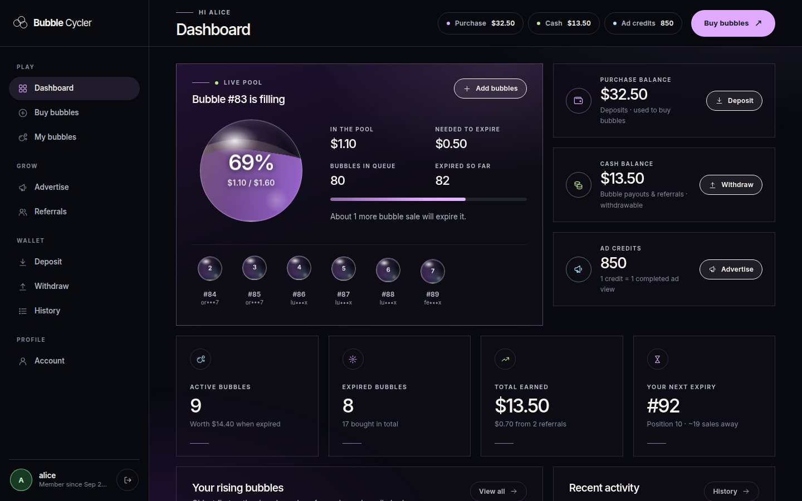
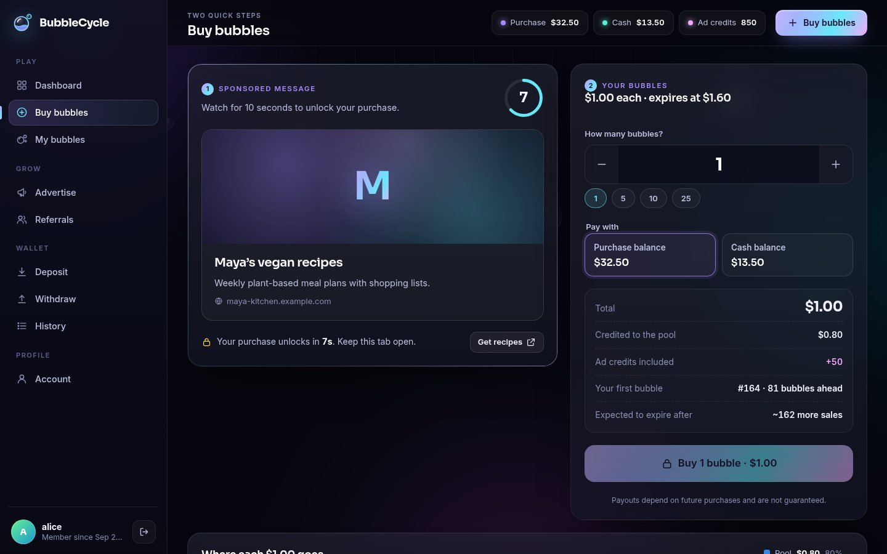
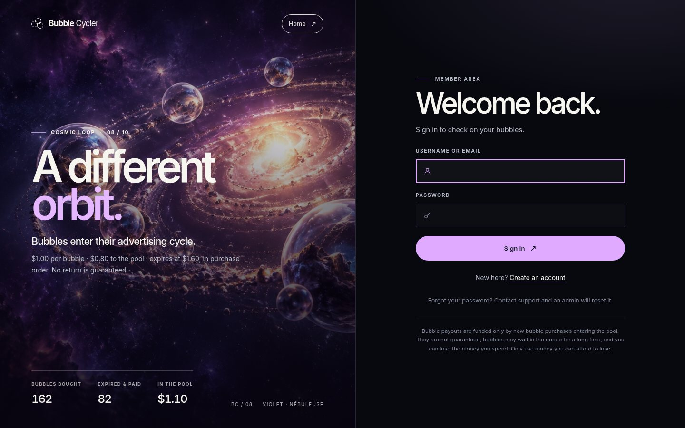
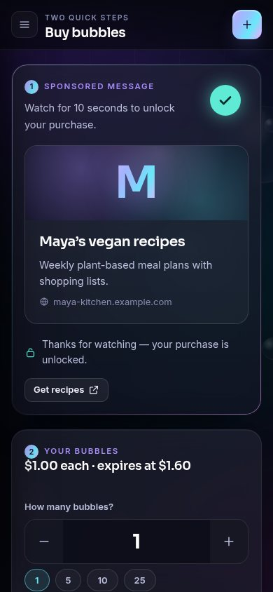
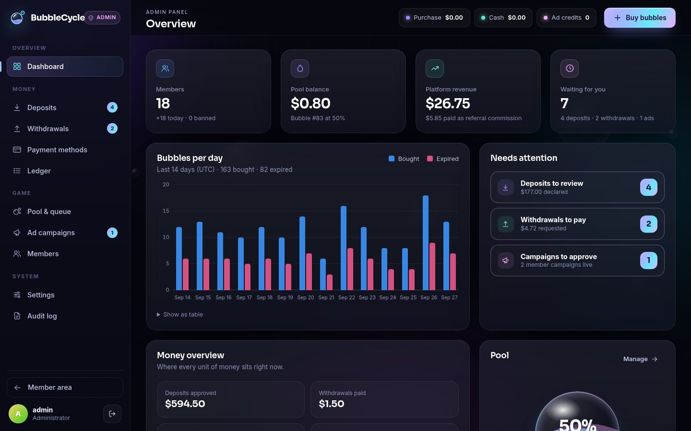
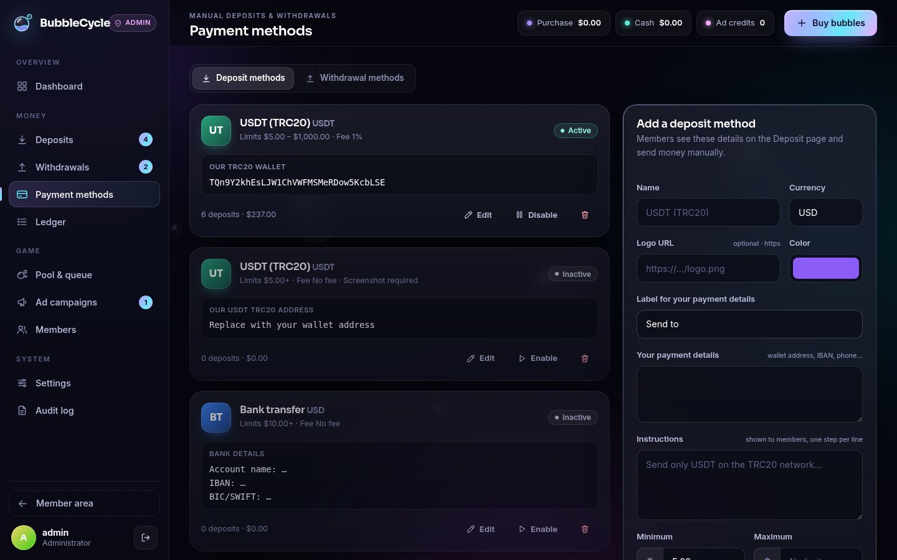
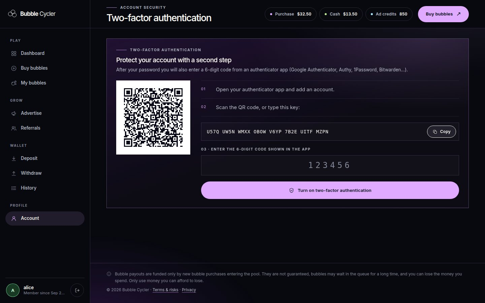
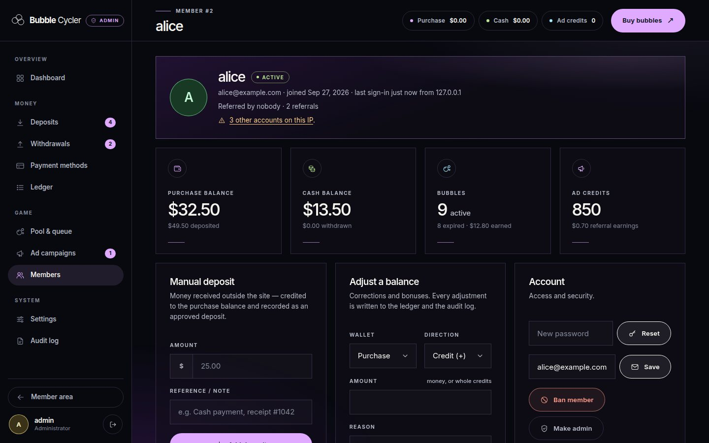

# Bubble Cycler — bubble game cycler with a built-in ad network

A complete bubble cycler written in **pure PHP 8** (no framework, no Composer, no build step) on MySQL / MariaDB.
Members buy **$1.00 bubbles**, **$0.80** of each purchase goes into a first-in-first-out pool, and every bubble
**expires at $1.60**. Each bubble also comes with **advertising credits**, and a **sponsored message plays before every
purchase**. Deposits and withdrawals use **manual payment methods that you manage from the admin panel**.

The interface is the **Cosmic Loop design (edition 08)**: the landing page reproduces the mockup element for element,
and the same art direction runs through the sign-in pages, the member area and the admin panel.

The whole app is **in English by default and fully translated into French**: visitors from France and French-speaking
browsers get French automatically, and everyone can switch with one click (see [Languages](#languages)).



| Member dashboard | Buy page with the ad gate |
|---|---|
|  |  |

| Sign in | Phone (390 px) |
|---|---|
|  |  |

| Admin overview | Manual payment methods |
|---|---|
|  |  |

| Two-factor authentication | Member file in the admin panel |
|---|---|
|  |  |

---

## Features

**Members**
- Buy 1–25 bubbles at a time (configurable) with the purchase balance or, optionally, the cash balance.
- Live pool: the bubble at the front of the queue fills up in real time; every bubble shows its queue position,
  how far it has risen and an estimate of how many new sales it still needs.
- Advertising credits with every bubble, and campaigns (headline, text, link, optional banner) with views,
  clicks and CTR. Campaigns can be paused, topped up, edited or deleted (unused credits are refunded).
- Deposits through the manual methods you define (with an optional payment screenshot), withdrawals from the cash
  balance, a full ledger, referral link with commissions, and account security settings.
- **Two-factor authentication** (any authenticator app, QR code, 10 one-time recovery codes), **password reset by
  email**, and email notices when a deposit is approved or a withdrawal is sent.
- Celebration when bubbles expire, toasts, keyboard-accessible UI, works on phones, installable on the home screen.
- **English and French** everywhere — pages, emails, error messages, dates, numbers and amounts — chosen
  automatically (country, then browser) and remembered on the member's account.

**Admin panel**
- Overview: members, pool, platform revenue, pending work, a 14-day chart of bubbles bought/expired, a money
  overview (where every cent sits) and the **queue gap** (money the pool still needs to expire every active bubble).
- **Deposits**: review queue with the proof screenshot, approve (you can change the credited amount) or reject with a reason.
- **Withdrawals**: mark as paid with a payment reference, or reject (the amount is refunded).
- **Payment methods**: create deposit and withdrawal methods (crypto wallet, bank transfer, mobile money, PayPal…)
  with your payment details, instructions, min/max, fixed and percentage fees, and a "screenshot required" switch.
- **Members**: search by name, email or IP, manual deposit, credit/debit any wallet, ban, admin rights, password and
  email changes, two-factor reset, and a warning when a member signed up from the same IP as their referrer.
- **Pool & queue**: live state, full queue and history, and pool top-ups (promotions) that pay the queue in order.
- **Ad campaigns**: moderation (approve / reject / pause / delete) and free, unlimited house ads.
- **Settings**: every number of the economy, ad timer and credits, limits, registrations, maintenance mode,
  timezone, currency symbol, **email (SMTP)** with a test button, **security** (two-factor required for admins,
  sign-ups per IP), risk disclaimer, terms and privacy policy (each with an optional French version).
- **CSV exports** of deposits, withdrawals, the ledger and members (safe to open in Excel).
- **Audit log** of every admin action.

**Design** — the Cosmic Loop design system (edition 08): deep-space background, violet accent, the nebula artwork,
Inter only with large, tightly tracked headlines, micro uppercase labels led by an accent rule, pill buttons with arrow
glyphs, square hairline panels and circles for icons. The landing page (English and French) is the mockup's markup
and stylesheet unchanged; the sign-in pages, member area,
admin panel, legal, error and install pages extend the same rules (`public/assets/css/app.css`). Bubbles are CSS glass
spheres that fill with violet liquid and turn gold when they expire. Self-hosted font, responsive down to 320 px,
respects `prefers-reduced-motion`.

---

## How the cycler works

| Setting (Admin → Settings) | Default | Meaning |
|---|---|---|
| Bubble price | $1.00 | What a member pays per bubble |
| Credited to the pool | $0.80 | Part of the price that enters the pool |
| Expires at | $1.60 | A bubble expires once the pool has paid it this much |
| Referral commission | $0.05 | Paid to the buyer's referrer, out of the platform share |
| Ad credits per bubble | 50 | 1 credit = 1 completed ad view |

Bubbles wait in **one queue, in purchase order**. The pool only ever pays the bubble at the front. As soon as the
pool holds that bubble's target, the bubble **expires**, its owner's cash balance is credited with the full $1.60,
and the next bubble moves up. With the defaults every **2 new bubbles** expire one bubble ($1.60 ÷ $0.80).

```
Alice buys 1  → pool $0.80   bubble #1 is 50 % full
Bob buys 1    → pool $1.60   #1 expires → Alice +$1.60, pool $0.00, #2 moves to the front
Carol buys 3  → pool $2.40   #2 expires → Bob +$1.60, pool $0.80 fills #3 to 50 %
```

Each dollar splits into $0.80 pool / $0.05 referrer / $0.15 platform (or $0.20 platform when the buyer has no
referrer). Changing the economics later only affects new bubbles: each bubble keeps the target it was bought with.

Money is stored as integers (1.00 = 1 000 000), every balance change goes through the ledger inside a database
transaction, and every purchase locks the pool row, so concurrent buyers can never double-spend or break the queue
order. Bubbles are paid in batches: in the load test a pool top-up that expired 20 000 bubbles took about 3 seconds. The test suites
check that **every cent is accounted for** after each scenario.

> **Be honest with your members.** Bubbles are paid only from new purchases (and any amount you add to the pool).
> If purchases slow down, bubbles wait longer and some may never expire. The default disclaimer, landing page and
> terms say this plainly — keep them. Schemes where earlier participants are paid from later participants' money are regulated
> or prohibited in many countries: check the law where you operate before accepting real money.

---

## Advertising

- Every purchase is preceded by a **sponsored message** shown for `ad_seconds` (default 10 s). The timer is enforced
  on the server; the countdown in the browser is only a convenience. One completed view unlocks **one** purchase.
- Refreshing the page does not restart the countdown (the view is reused for 30 minutes).
- Rotation: member campaigns with credits first, least recently shown first, never the viewer's own campaign.
  House ads fill in when no member campaign is running; if nothing is active, purchases are unlocked automatically.
- A credit is charged only when the countdown completes; clicks are counted once per view.
- Member campaigns can require admin approval (on by default). Banner images must be `https://` URLs.

---

## Manual deposits & withdrawals

1. **Admin → Payment methods → Add a deposit method**: name, your wallet address / bank details, instructions,
   limits, fees, and whether a payment screenshot is required. Activate it.
2. The member picks the method on **Deposit**, sends the money, and submits the amount, the transaction reference and
   optionally a screenshot. Duplicate references are refused.
3. **Admin → Deposits**: open the request, check the payment, then **Approve & credit** (the amount is editable, e.g.
   if less was received) or **Reject** with a reason. Screenshots are stored outside the web root and only admins
   can open them.
4. You can also credit money received any other way: **Admin → Members → member → Manual deposit**.

Withdrawals are taken from the cash balance as soon as they are requested. The admin sends the payment by hand and
clicks **Mark as paid** (with the payment reference), or **Reject** to refund it. Members can cancel pending requests.
All payment amounts are in whole cents.

---

## Languages

English is the default language; every screen, email, error message and notice is also available in French.

**How the language is chosen** (first match wins):

1. a language picked with the switch (`?lang=en` / `?lang=fr`) — remembered for a year in the `bubble_lang` cookie
   and on the member's account;
2. that cookie;
3. the language saved on the member's account (set at sign-up, so it follows members to every device);
4. the visitor's country, when the hosting provides it: **France and French overseas territories → French**
   (FR, GP, MQ, GF, RE, YT, PM, BL, MF, NC, PF, WF, and Monaco). Headers read: `CF-IPCountry` (Cloudflare),
   `CloudFront-Viewer-Country`, `X-AppEngine-Country`, `X-Country-Code`, and `GEOIP_COUNTRY_CODE` /
   `X-GeoIP-Country` (Apache/nginx GeoIP modules);
5. the browser's `Accept-Language` (French when it is the best supported language);
6. English.

Behind Cloudflare, turn on *IP Geolocation* (Network settings) so `CF-IPCountry` is sent. Pages answer with
`Content-Language` and `Vary: Accept-Language, Cookie`.

**Where to switch**: the `EN | FR` switch in the member and admin sidebar, and the pill next to the home link on the
landing, sign-in, legal, error and install pages.

**What changes with the language**: every text; dates (`Oct 8, 2026` / `8 oct. 2026`), numbers (`1,234` / `1 234`),
amounts (`$1.60` / `1,60 $`) and percentages (`12.5%` / `12,5 %`), including the live figures computed in the
browser. Emails are written in the **recipient's** language (admin notifications in the admin's). Ledger lines and the
audit log are stored in English and shown in the reader's language.

**Your own texts**: *Admin → Settings → Legal* has an English and a French field for the risk disclaimer, the terms and
the privacy policy. An empty French field falls back to the French translation of the default text (or your English
text if you wrote one). Payment methods, house ads and campaign texts are shown as you type them.

**Translations** live in `app/lang/fr.php` (English text → French text). `php tools/i18n-check.php` lists every text
the app can show and fails if one has no translation, if a `{placeholder}` is lost, or if a template still contains
untranslated text. To add a language: add it to `LANGUAGES` in `app/lib/i18n.php`, create `app/lang/xx.php` and
the landing copy in `app/lang/landing.php`.

---

## Requirements

- PHP **8.1+** with `pdo_mysql`, `mbstring`, `fileinfo`, `openssl` and `sodium` (all standard)
- MySQL **5.7+ / 8.x** or MariaDB **10.4+**
- Apache (the `.htaccess` files are included) or nginx, with HTTPS
- An SMTP account for emails (password resets) — any provider: your host, Brevo, Mailgun, Amazon SES, Gmail…

## Installation

1. Upload the `bubble-cycler/` folder and create an empty database (`utf8mb4`) plus a user with full rights on it.
2. Point the web server's **document root at `bubble-cycler/public/`**.
   On shared hosting where you cannot change it, upload the folder as-is: the root `.htaccess` routes every request
   into `public/` and blocks `app/`, `database/`, `storage/` and `tests/`.
3. Make `app/` (for `config.php`) and `storage/` writable by PHP.
4. Open `https://your-domain/install.php` and fill in the database, the site name and your admin account.
   The installer creates the tables, writes `app/config.php` (with a fresh encryption key, debug off and HTTPS
   redirects on when installed over HTTPS) and locks itself with `storage/installed.lock`.
5. Sign in: the admin panel first asks you to set up **two-factor authentication**. Keep the recovery codes.
6. Run `php bin/admin.php check` on the server and fix anything it reports.
7. Delete `public/install.php` (optional, it is already locked).

**nginx**

```nginx
server {
    listen 443 ssl http2;
    server_name example.com;
    root /var/www/bubble-cycler/public;
    index index.php;

    location / { try_files $uri $uri/ =404; }
    location ~ \.php$ {
        include snippets/fastcgi-php.conf;
        fastcgi_pass unix:/run/php/php8.3-fpm.sock;
    }
    location ~ /\. { deny all; }
    location ~* \.(css|js|svg|png|jpg|webp|woff2)$ { expires 1y; add_header Cache-Control "public, immutable"; }
    client_max_body_size 6m;
    gzip on;
    gzip_types text/css application/javascript application/json image/svg+xml text/csv;
}
```

**Local development**

```bash
php -S 127.0.0.1:8080 -t public
# then open http://127.0.0.1:8080/install.php
```

## Going live checklist

1. `php bin/admin.php check` reports no problem (HTTPS, `app_key`, `base_url`, debug off, writable folders, clock).
2. **Admin → Settings → Email**: enter your SMTP details and press **Save & send a test email to me**. Without email,
   members cannot reset forgotten passwords.
3. **Admin → Payment methods**: replace the example details with your real ones and activate at least one deposit
   and one withdrawal method (the examples are created inactive on purpose).
4. **Admin → Settings**: review the economics, the ad timer, limits, timezone, support email and the legal texts
   (terms and privacy policy).
5. Create or edit the **house ad** (Admin → Ad campaigns → House ads).
6. Behind Cloudflare or a proxy, set `ip_header` / `trust_proxy` in `app/config.php`.
7. Add the cron job and the daily backup below, and restore a backup once to be sure it works.
8. Check the law where you operate (see the warning above) and keep the risk disclaimer visible.

## Operations

**Cron** (optional — clean-up also runs on 1 % of page views):

```cron
15 * * * * php /var/www/bubble-cycler/bin/admin.php housekeeping > /dev/null
```

**Command-line tools** (`php bin/admin.php …`, run on the server):

| Command | Does |
|---|---|
| `check` | Health check: PHP version and extensions, configuration, database schema, clock, writable folders, email |
| `stats` | Pool balance, queue length, amounts paid, platform revenue, queue gap |
| `migrate` | Apply pending database migrations (also automatic on the first request after an update) |
| `housekeeping` | Delete expired sign-in attempts, rate limits, reset links and old ad views |
| `unlock <username\|ip>` | Clear failed sign-in attempts (15-minute lock-out) |
| `reset-2fa <username>` | Turn off two-factor authentication for someone who lost their phone and recovery codes |
| `set-password <username>` | Set a new random password and print it (`--stdin` to type one) |

**Backups** — everything lives in the database plus `app/config.php` and `storage/uploads/`:

```bash
mysqldump --single-transaction --routines bubble_db | gzip > /backups/bubble-$(date +%F).sql.gz
tar czf /backups/bubble-files-$(date +%F).tgz app/config.php storage/uploads
```

Keep `app/config.php` safe: its `app_key` decrypts the two-factor secrets and the SMTP password. If it is lost, every
member has to set up two-factor again (`reset-2fa`) and the SMTP password must be re-entered.

**Updating** — replace the files except `app/config.php` and `storage/`, then open any page or run
`php bin/admin.php migrate`: database changes are applied automatically, once, under a lock.

**Uptime monitoring** — `https://your-domain/health.php` answers `200 {"ok":true}` when PHP and the database work,
`503` otherwise. It stays up during maintenance mode.

## Configuration (`app/config.php`)

| Key | Purpose |
|---|---|
| `db` | Database host (or socket path), port, name, user, password |
| `base_url` | Public URL, e.g. `https://example.com`. **Required for emails** (links in reset emails never trust the request's host) |
| `app_key` | 32 random bytes (base64) that encrypt two-factor secrets and the SMTP password. Keep it secret, never change it |
| `debug` | Show error details — never on a live site. Errors are logged to `storage/logs/app.log` (rotated at 5 MB) |
| `force_https` | Redirect every `http://` request to `https://` |
| `hsts` | Send `Strict-Transport-Security` on HTTPS responses (default on) |
| `session_idle` | Sign members out after this many seconds without activity (default 7200) |
| `csp` | Send the Content-Security-Policy header (turn off only if you add third-party scripts) |
| `ip_header`, `trust_proxy` | Real client IP / HTTPS detection behind a proxy (e.g. `HTTP_CF_CONNECTING_IP`) |
| `mail_verify_peer` | Verify the SMTP server's TLS certificate (default on — only turn off for a local relay) |

Environment variables: `BUBBLE_CONFIG` loads the configuration from another path, `BUBBLE_STORAGE` moves the
writable folder (sessions, logs, uploads) elsewhere, e.g. outside the web root. No cron job is required: the queue is
processed inside each purchase.

---

## Project structure

```
bubble-cycler/
├── app/
│   ├── bootstrap.php          loaded by every page
│   ├── config.sample.php      config template (the installer writes config.php)
│   ├── lib/                   plain PHP functions
│   │   ├── cycler.php         FIFO pool, purchases, expirations, queue maths
│   │   ├── ads.php            ad gate, rotation, campaigns, house ads
│   │   ├── payments.php       manual methods, deposits, withdrawals
│   │   ├── ledger.php         wallets & transactions (the only way balances change)
│   │   ├── security.php       two-factor codes, recovery codes, rate limits, encrypted secrets
│   │   ├── mailer.php         SMTP client, email templates, notifications
│   │   ├── export.php         streamed CSV exports
│   │   ├── migrations.php     database versions and upgrades
│   │   ├── auth.php, admin.php, settings.php, money.php, db.php, ui.php, uploads.php, helpers.php
│   │   ├── i18n.php           languages: detection, t()/tn(), local dates, numbers and amounts
│   │   ├── landing.php        landing page data (language, copy, settings) for the Cosmic Loop template
│   │   └── installer.php
│   ├── lang/fr.php            French translations (English text → French text)
│   ├── lang/landing.php       landing copy, English and French
│   └── views/                 layouts, partials and page templates (public/landing.php = the mockup's markup)
├── bin/admin.php              command-line tools for the operator
├── database/schema.sql        tables (run automatically by the installer)
├── docs/AUDIT.md              production-readiness audit: findings, fixes, test and load results
├── fixtures/landing.php       the mockup's exact texts, to check the landing template against it
├── mockups/                   the Cosmic Loop design package, frozen (never edited), and its rendered DOM
├── public/                    web root: one PHP file per page, admin/, assets/
├── storage/                   sessions, logs and uploaded payment screenshots (private)
├── tests/                     CLI test suites
└── tools/                     translation check (i18n-check.php), landing DOM check (dom-sig.php, render-landing.php)
```

Pages follow the same pattern: `public/<page>.php` handles the request and calls
`render('<folder>/<view>', $data)`, which renders `app/views/<folder>/<view>.php` inside a layout.

## Security

- PDO prepared statements everywhere, strict SQL mode on every connection, `password_hash()` passwords (common
  passwords refused), CSRF token on every form, escaped output, strict Content-Security-Policy (no inline scripts),
  HSTS, `X-Frame-Options`, `Cross-Origin-Opener-Policy`, no `X-Powered-By`.
- Sessions: stored in the app's own private folder, regenerated at sign-in, signed out after 2 h of inactivity and on
  every other device when the password changes.
- Sign-in throttling per IP and per account (with constant-time answers that do not reveal which accounts exist),
  optional **TOTP two-factor authentication** with replay protection (required for admins by default), rate limits on
  password resets, two-factor attempts, password checks and sign-ups per IP, and a honeypot against sign-up bots.
- Password-reset links are single-use, expire after one hour and only their hash is stored; emails tell members about
  password, email and two-factor changes.
- Every balance change is a locked, transactional ledger write that refuses to go negative; deadlocks are retried;
  purchase forms carry a one-time token so a double click or a resubmitted page never buys twice.
- Uploads are validated (type, size, real image), renamed randomly and stored outside the web root; two-factor
  secrets and the SMTP password are encrypted with `app_key`.
- Ad destinations must be `http(s)` URLs, redirects after sign-in stay on the site, CSV exports neutralise spreadsheet
  formulas, members' names are masked in public feeds, and every admin action is written to the audit log.

See [`docs/AUDIT.md`](docs/AUDIT.md) for the full audit.

## Tests

The suites run against a throw-away database whose name **must end with `_test`** (all its tables are dropped):

```bash
export BUBBLE_TEST_DB=bubble_test BUBBLE_TEST_USER=root BUBBLE_TEST_PASS=secret
php tests/cycler_test.php   # 281 checks: FIFO maths, batch payouts, ad gate, payments, campaigns, 2FA, resets, migrations
php tests/stress_test.php   # 13 parallel processes, then every accounting invariant
php tests/http_test.php     # 218 checks: every page and form through a real web server, both languages (needs curl)
php tests/smtp_test.php     # SMTP client against a local fake server: STARTTLS, AUTH, dot-stuffing, errors
php tests/load_test.php     # HTTP load: members buy, deposit and withdraw while an admin approves (args: members seconds)
```

`php tools/i18n-check.php` (no database needed) checks that every text has its French translation.

The landing template is checked against the frozen mockup: rendered with the mockup's texts (`fixtures/landing.php`),
its DOM must match the mockup's exactly — every element, class and text.

```bash
php tools/render-landing.php fr > /tmp/landing.html
diff <(php tools/dom-sig.php mockups/landing.fr.html) <(php tools/dom-sig.php /tmp/landing.html) && echo "0 differences"
```

After every scenario the suites verify that no money was created or lost, that every ledger line carries the right
running balance, that the queue stayed in strict order and that each expired bubble was paid exactly once.

---

## Résumé en français

Script de « bubble cycler » complet en **PHP pur** + MySQL : bulle à 1 $, 0,80 $ versés dans un pool FIFO, chaque
bulle expire à 1,60 $, crédits publicitaires offerts à chaque achat, publicité obligatoire (10 s, vérifiée côté serveur)
avant chaque achat, méthodes de dépôt/retrait manuelles gérées depuis le panneau admin, validation des dépôts avec
capture d'écran, design « Cosmic Loop » (édition 08) : page d'accueil reproduite à l'identique de la maquette, même
direction artistique pour la connexion, l'espace membre, l'admin, les pages légales et d'erreur.

Application **en anglais par défaut et entièrement traduite en français** : les visiteurs situés en France (et dans
les départements et territoires d'outre-mer) ou dont le navigateur est en français la voient automatiquement en
français ; un sélecteur EN | FR permet de changer, et le choix est mémorisé (cookie et compte du membre). Dates,
nombres et montants au format français, e-mails dans la langue du destinataire, textes légaux personnalisables en
français dans *Admin → Réglages → Mentions légales*. Traductions : `app/lang/fr.php`, vérifiées par
`php tools/i18n-check.php`. Installation : pointer la racine web sur `public/`, créer une base MySQL,
ouvrir `/install.php`. Pensez à activer vos méthodes de paiement réelles et à vérifier la législation de votre pays.

Prêt pour la production : double authentification (application d'authentification + codes de secours, obligatoire
pour les admins), réinitialisation du mot de passe par email (SMTP configurable depuis l'admin, bouton d'email de
test), notifications de paiement, exports CSV, limites anti-abus, migrations automatiques de la base, outil en ligne
de commande `php bin/admin.php` (`check`, `migrate`, `reset-2fa`…) et rapport d'audit complet dans `docs/AUDIT.md`.

Font: [Inter](https://github.com/rsms/inter), SIL Open Font License (see `public/assets/fonts/`).
